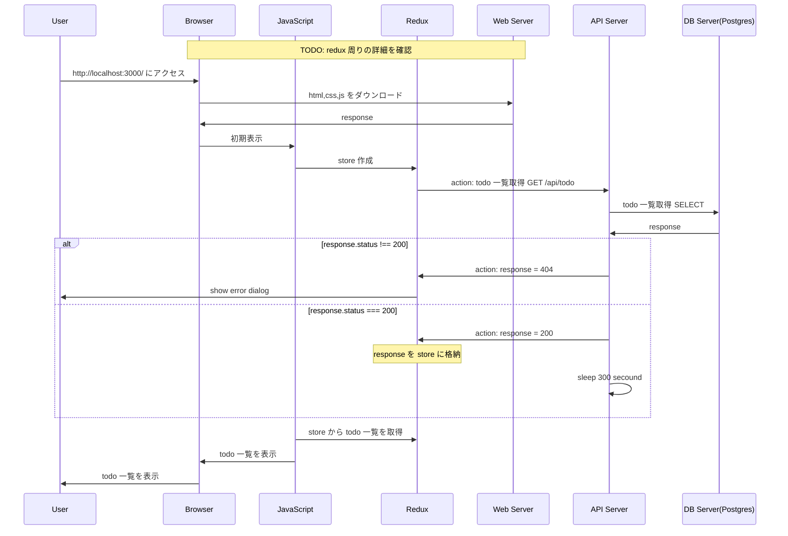

# Todo app シーケンス

## トップ画面

```mermaid
sequenceDiagram
participant user as User 
participant browser as Browser 
participant js as JavaScript
participant redux as Redux
participant webServer as Web Server 
participant api as API Server
participant db as DB Server(Postgres)

Note over browser, webServer: TODO: redux 周りの詳細を確認

user ->> browser : http://localhost:3000/ にアクセス
browser ->> webServer : html,css,js をダウンロード
webServer ->> browser : response
browser ->> js : 初期表示
js ->> redux: store 作成
redux ->> api: action: todo 一覧取得 GET /api/todo
api ->> db: todo 一覧取得 SELECT
db ->> api: response

alt response.status !== 200
    api ->> redux: action: response = 404
    redux ->> user: show error dialog
else response.status === 200
    api ->> redux: action: response = 200
    Note over redux: response を store に格納
    // api ->> api: sleep 300 secound
end

js ->> redux: store から todo 一覧を取得
js ->> browser: todo 一覧を表示
browser ->> user: todo 一覧を表示
```
